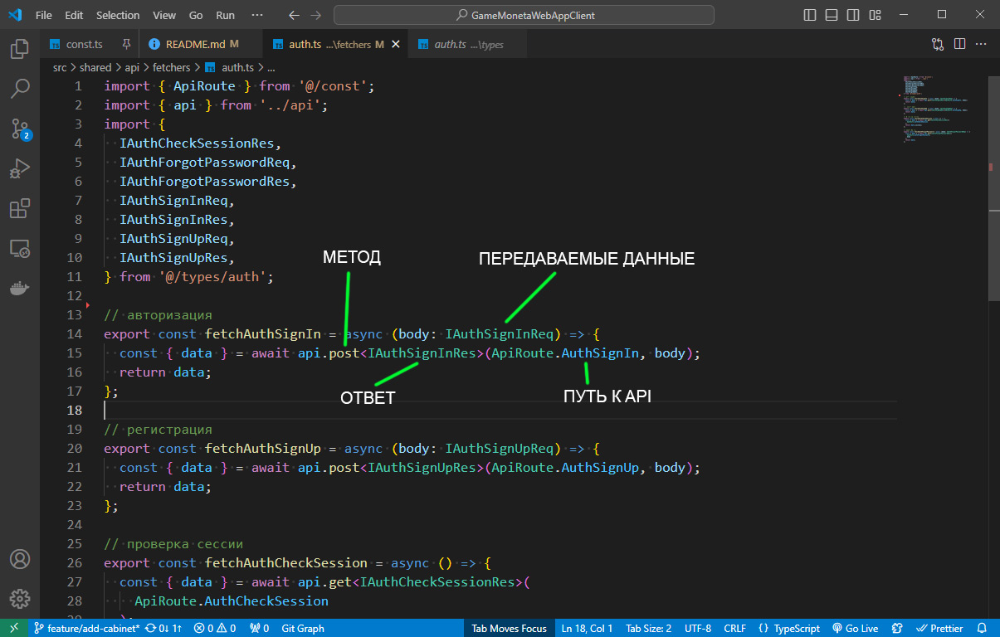

# GameMonetaWebAppClient.

Client on react+ts for webapp GameMoneta

### Docs

- [настройка авторизации через vk](src/pages/sign-in/ui/oauth/readme.md)

#### Как добавлять api роуты на бекенд? Где взять "схемы" которые нужны фронтенду?

Открываем папку `src/shared/api/fetchers`.

Каждый файл в папке - это группа методов.

Каждая функция в файле это отдельный метод. Из которой мы сразу можем видеть все что нам нужно для создания api методов на бекенде:

- тип запроса (get/post)
- api адресс (ApiRoute)
- передаваемые данные (body/params)
- возвращаемые данные



Кликая с зажатым Ctrl по "типам" будут открываться вкладки с подробной типизацией объектов.

⚡ **Есть одна функция без подробной типизации данных которые передаются на сервер.** `fetchProfileAvatarChange()` данная функция отвечает за загрузку аватарки и принимает в качестве параметров FormData с файлом.

Файл где она используется: `src/pages/profile/ui/profile-avatar/ProfileAvatar.tsx`. Файл передается в "поле" `file`.

```ts
const formData = new FormData();
formData.append('file', e.target.files[0]);
changeAvatarMutation.mutate(formData);
```

⚡ **Есть один API route** которого нету в вышеупомянутой папке. Это `oauth/vk`. Который служит для авторизации через ВК.

#### Как включить приватные страницы только для авторизованных?

Для тестов/разработки я отключил переадресацию для не авторизованных пользователей.

Включить ее можно в файле `src/pages/routing.tsx`, просто раскоментировав помеченный участок кода.

#### Как на бекенде узнать от какого авторизованного пользователя идут api запросы?

Когда пользователь авторизован, то во все его запросы добавляется заголовок с токеном авторизации.

```ts
headers['Authorization'] = `Bearer ${token}`;
```
